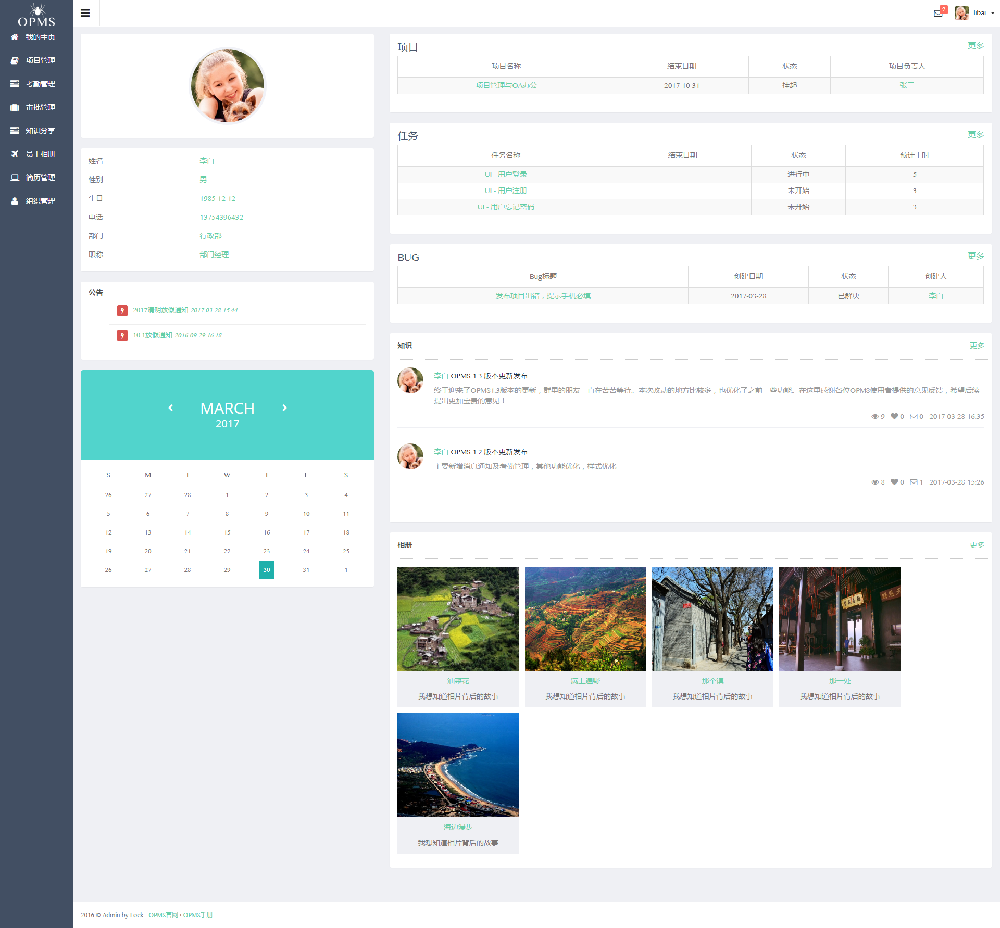

# go-oa

基于 go + beego 开发的 OA 系统，fork 自 opms 项目，但原项目已经十分老旧，新版本作者也不打算开源，因此我对其进行大刀阔斧的重构，以适应现代化需求。

以下是原项目介绍：

> OPMS项目+OA管理系统
>
> OPMS管理系统是意思是PMS+OA，项目+办公管理。符合日常项目和OA管理，特别适合扁平化管理的微中小企业。
>
> OPMS采用是Beego框架和Bootstrap前端框架构建立，适合不同平台，不同的终端，简单方便实用的原则。数据库采用Mysql，缓存采用Redis。在部署过程中，如果没有Redis，不影响使用。
>
> 本系统是免费的软件，部署很方便。
>
> OPMS的由来：
>
> 公司之前用的项目管理软件是禅道PMS，功能是很强大，学习成本也大。
>
> 在实际的项目应用中，有许多功能点都用不到或者很少用，可能它的系统是面向不同行业项目管理吧。
>
> 结合实际的项目要求和人事的日常工作经验要求，于是OPMS管理系统诞生了！
>

# 效果图预览

